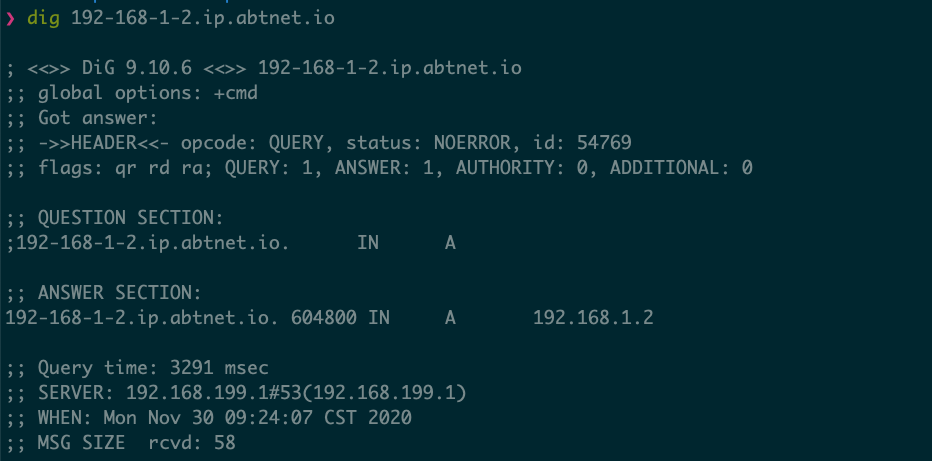

# IP Echo DNS

A simple DNS server that does nothing but resolve `*.ip.abtnet.io` to `*`, with which all ABT Node instances have have built-in https support.

The domain for any newly created IP can by `192-168-1-2.ip.abtnet.io` and this resolves to `192.168.1.2`, as you can see from the following screenshot:

## Setup

1. Install `IP Echo DNS` blocklet from ABT Node marketplace
2. Start the `IP Echo DNS` blocklet, you can customize ip address
3. If you want to host your own abt node domain and https-certificate, you can leverage `routing.dashboardDomain` and `routing.dashboardCertDownloadAddress` config options in ABT Node.
